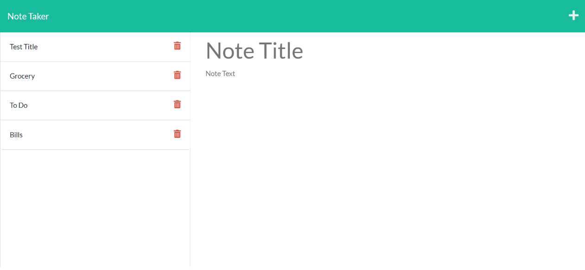

# Note-Taker

## Description

My motivation in completing this project was to apply what I learned this week about Express. This includes topics such as HTML & API routes, query parameters, GET/POST, static assets, Insomnia, middlware, and Heroku.  I built this project because I wanted to test my skills and see if I could be effective in creating a Note Taker. Through this project I learned more about how to make sure I line up my front end with my backend. I faced a couple small challenges with this project, but mostly figuring out how my backend affects functions that happen in the front end. 

## Future Development

I would like to add functionality to the trash can icon. I will do this through the app.delete route. DELETE /api/notes/:id should receive a query parameter that contains the id of a note to delete. To delete a note, I will need to read all notes from the db.json file, remove the note with the given id property, and then rewrite the notes to the db.json file.

## Sample Application Appearance

## Link to Deployed Application
https://note-taker-challenge-9.herokuapp.com/

